# CPTED HELPER

---

## Intro

---

- Selected the TOP 20 most crime-prone streets in 685 streets in Donjak-gu, Seoul by analyzing the open data with Python, Scikit-learn.
- Verified the results through an on-site survey and suggested them to the Dongjak-gu district office for helping accelerate their CPTED(Crime Prevention Through Environmental Design) project.
- [Online Presentation](https://youtu.be/HBVjWPA_vf8)

## PPT

---

 
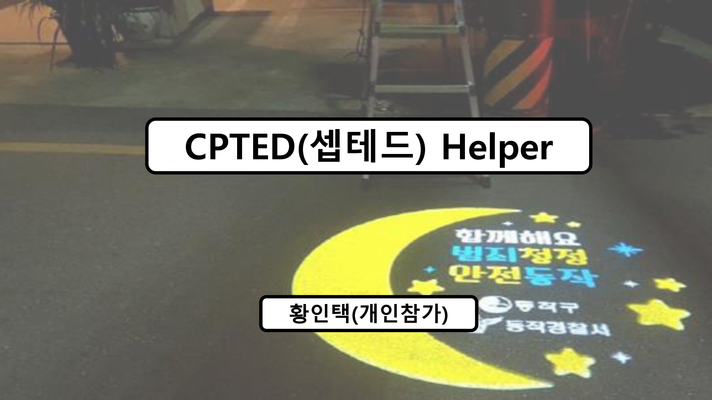

 
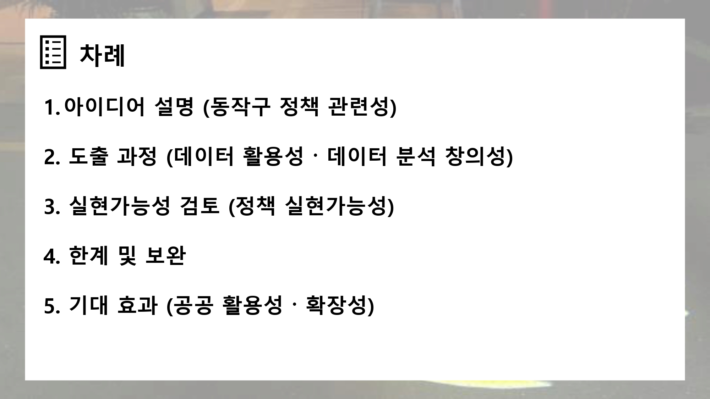

 
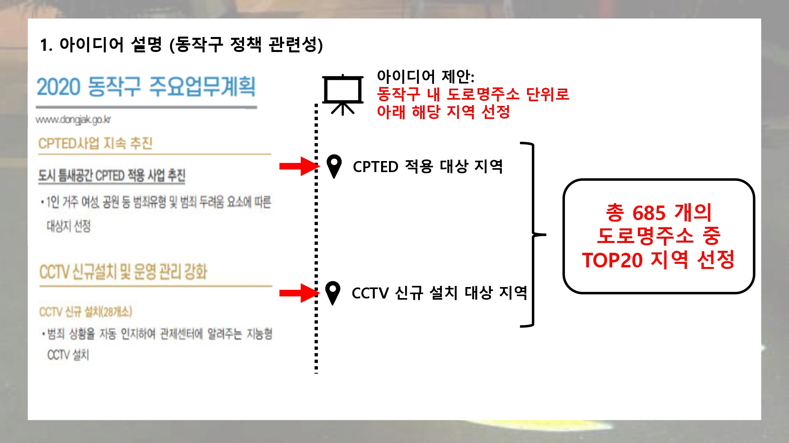

 
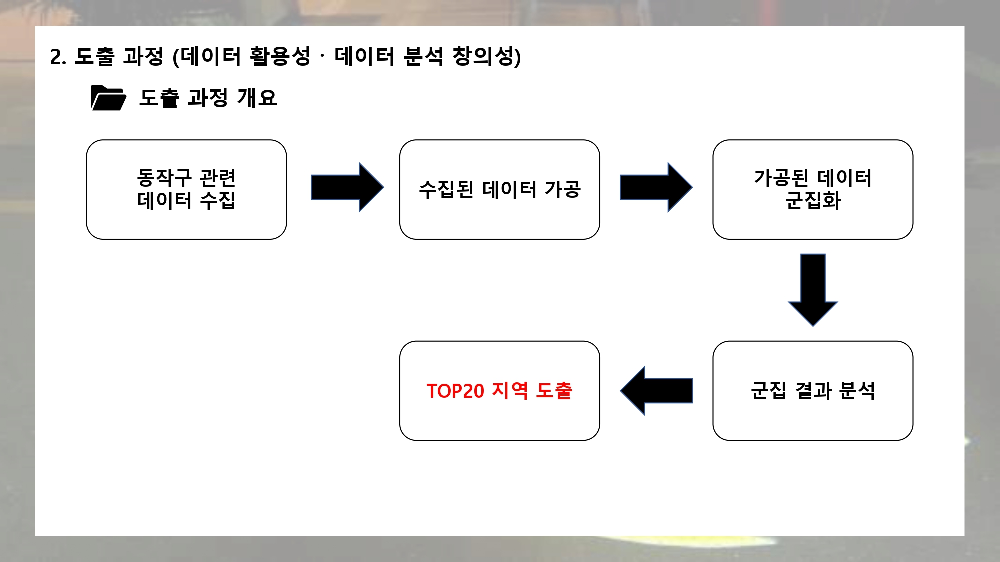

 
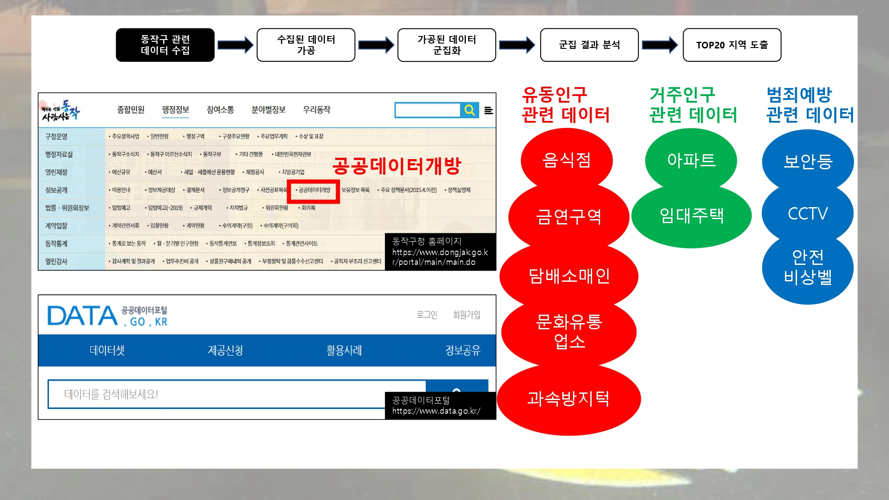

 
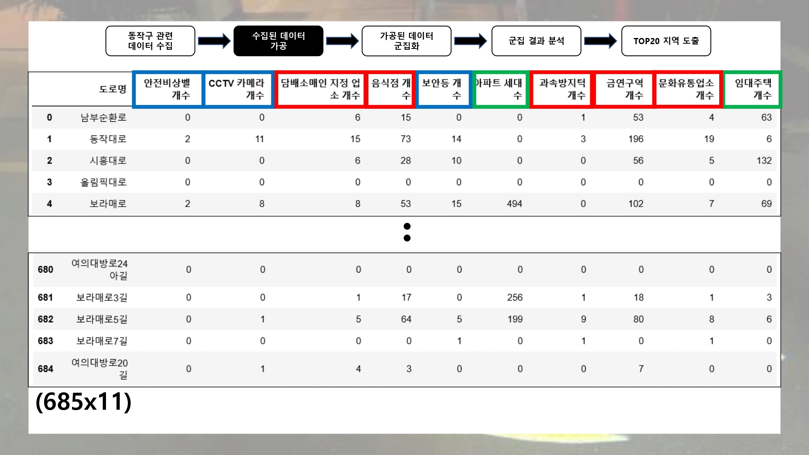

 
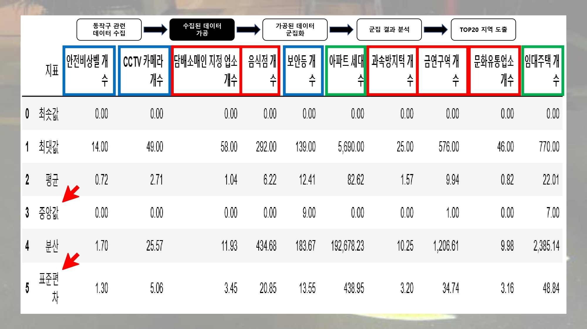

 
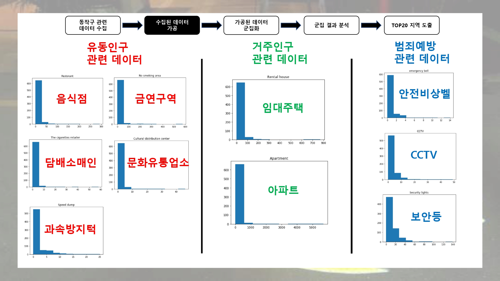

 

 

 

 

 

 

 
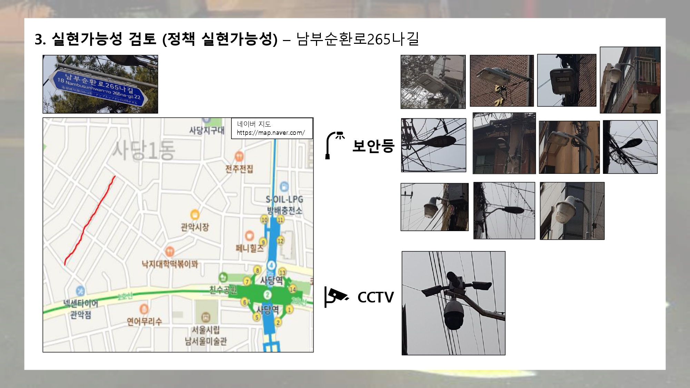

 

 

 

 
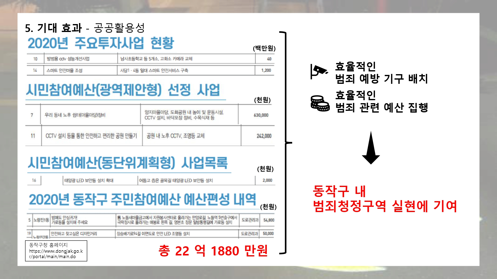

 
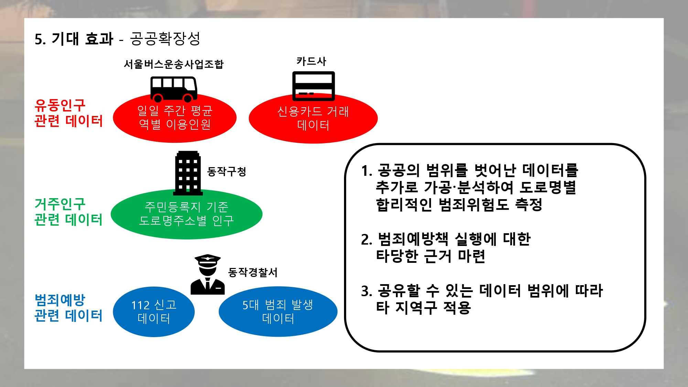

 
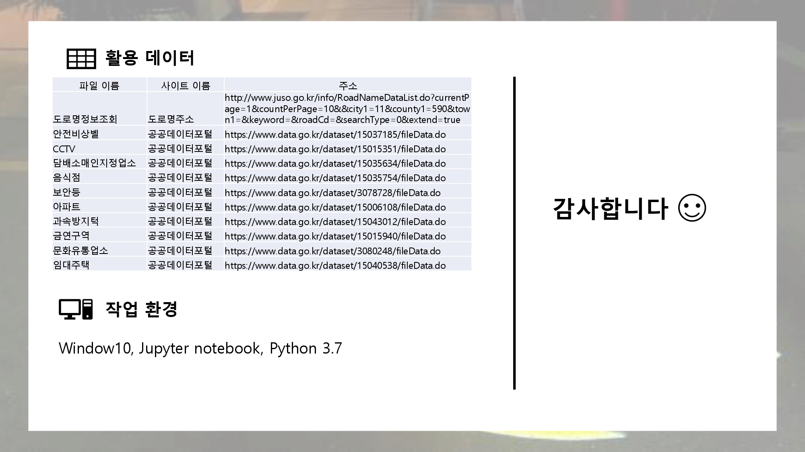
